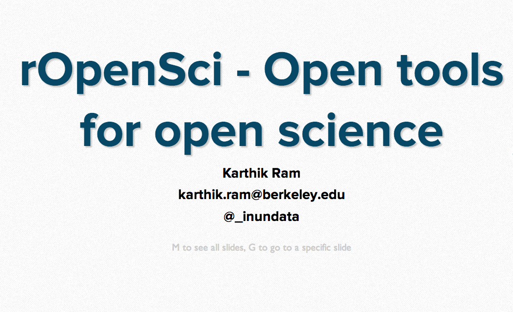

rOpenSci is a project based at the University of California, Berkeley's museum of Paleontology and funded by the Alfred P. Sloan foundation. Our mission is to foster a culture of transparency, reproducibility of data and code and allow scientists to build upon existing methods and findings to rapidly accelerate science. 

Our current mission to is lower technical and cultural barriers to greater data sharing and reuse and foster a culture of openness in the sciences. We're starting out the our home discipline of Ecology and Evolution and slowly hope to branch out to other disciplines with domain specific partners.

We welcome any questions, comments, suggestions for tools to develop, and/or potential collaborations. Please reach out to us at support at ropensci dot org.

