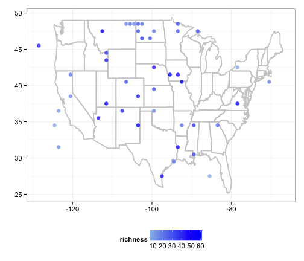

## rgbif use case No. 2 - Biodiversity comparisons across cities

In this example, we compare biodiversity in different regions using GBIF data from rgbif.

This example can be done using BISON data as well with our rbison package.


### Load libraries


```coffee
library(rgbif)
library(ggplot2)
library(plyr)
library(doMC)
```


### Get GBIF data using the rOpenSci package rgbif.

We'll not restrain our search to any particular taxonomic group, although you will likely do that in your own research. We'll make a new column with single lat/long coordinates for each cell for easy plotting. Last, we'll select 100 random cell IDs.


```coffee
temp <- gbifdata(densitylist(originisocountrycode = "US"))
temp <- transform(temp, lat = (minLatitude + maxLatitude)/2, lon = (minLongitude + 
    maxLongitude)/2)
cellids <- sample(temp$cellid, 100)
```


Then search for data for each of those cell ID's. We'll define a function to pass in each cell ID.


```coffee
getdata <- function(x, maxresults = 100) {
    out <- occurrencelist(cellid = x, coordinatestatus = TRUE, maxresults = maxresults)
    df <- gbifdata(out, coordinatestatus = TRUE)
    data.frame(cellid = x, richness = length(unique(df$taxonName)))
}
registerDoMC(cores = 4)
out <- ldply(cellids, getdata, .parallel = TRUE)
out2 <- merge(out, temp[, c("cellid", "lat", "lon")], by = "cellid")
# remove points outside the US
out3 <- out2[out2$lat < 49 & out2$lat > 24.7433195 & out2$lon > -130 & out2$lon < 
    -66.9513812, ]
```


### Plot data


```coffee
mapp <- map_data("state")
ggplot(mapp, aes(long, lat)) + geom_polygon(aes(group = group), fill = "white", 
    alpha = 0, color = "gray80", size = 0.8) + geom_point(data = out3, aes(lon, 
    lat, color = richness), size = 3, alpha = 0.8) + scale_color_gradient2(low = "white", 
    mid = "lightblue", high = "blue") + labs(x = "", y = "") + theme_bw(base_size = 14) + 
    theme(legend.position = "bottom", legend.key = element_blank())
```

 


### Notes

Bounding lat/long data from [here](https://raw.github.com/amyxzhang/boundingbox-cities/master/boundbox.txt)
