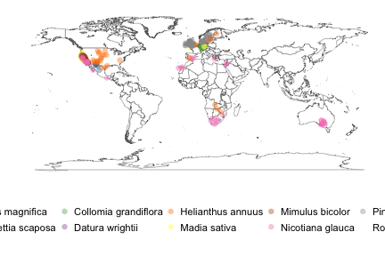

## taxize use case No. 1 - From a species list to cleaning names to a map of their occurrences.


### Load libraries


```coffee
library(taxize)
```


Most of us will start out with a species list, something like the one below. Note that each of the names is spelled incorrectly.


```coffee
splist <- c("Helanthus annuus", "Pinos contorta", "Collomia grandiflorra", "Abies magnificaa", 
    "Rosa california", "Datura wrighti", "Mimulus bicolour", "Nicotiana glauca", 
    "Maddia sativa", "Bartlettia scapposa")
```


There are many ways to resolve taxonomic names in taxize. Of course, the ideal name resolver will do the work behind the scenes for you so that you don't have to do things like fuzzy matching. There are a few services in taxize like this we can choose from: the Global Names Resolver service from EOL (see function *gnr_resolve*) and the Taxonomic Name Resolution Service from iPlant (see function *tnrs*). In this case let's use the function *tnrs*.


```coffee
# The tnrs function accepts a vector of 1 or more
splist_tnrs <- tnrs(query = splist, getpost = "POST", source_ = "iPlant_TNRS")

# Remove some fields
(splist_tnrs <- splist_tnrs[, !names(splist_tnrs) %in% c("matchedName", "annotations", 
    "uri")])
```

```
           submittedName         acceptedName    sourceId score
3       Helanthus annuus    Helianthus annuus iPlant_TNRS  0.98
1         Pinos contorta       Pinus contorta iPlant_TNRS  0.96
4  Collomia grandiflorra Collomia grandiflora iPlant_TNRS  0.99
5       Abies magnificaa      Abies magnifica iPlant_TNRS  0.98
10       Rosa california     Rosa californica iPlant_TNRS  0.99
9         Datura wrighti      Datura wrightii iPlant_TNRS  0.98
7       Mimulus bicolour      Mimulus bicolor iPlant_TNRS  0.98
8       Nicotiana glauca     Nicotiana glauca iPlant_TNRS     1
6          Maddia sativa         Madia sativa iPlant_TNRS  0.97
2    Bartlettia scapposa   Bartlettia scaposa iPlant_TNRS  0.98
```

```coffee

# Note the scores. They suggest that there were no perfect matches, but they
# were all very close, ranging from 0.77 to 0.99 (1 is the highest).  Let's
# assume the names in the 'acceptedName' column are correct (and they should
# be).

# So here's our updated species list
(splist <- as.character(splist_tnrs$acceptedName))
```

```
 [1] "Helianthus annuus"    "Pinus contorta"       "Collomia grandiflora"
 [4] "Abies magnifica"      "Rosa californica"     "Datura wrightii"     
 [7] "Mimulus bicolor"      "Nicotiana glauca"     "Madia sativa"        
[10] "Bartlettia scaposa"  
```


Another common task is getting the taxonomic tree upstream from your study taxa. We often know what family or order our taxa are in, but it we often don't know the tribes, subclasses, and superfamilies. taxize provides many avenues to getting classifications. Two of them are accessible via a single function (*classification*): the Integrated Taxonomic Information System (ITIS) and National Center for Biotechnology Information (NCBI); and via the Catalogue of Life (see function *col_classification*):


```coffee
# Get UIDs for species through NCBI
uids <- get_uid(sciname = splist, verbose = FALSE)

# Let's get classifications from ITIS using Taxonomic Serial Numbers. Note
# that we could use uBio instead.
class_list <- classification(uids)

# And we can attach these names to our allnames data.frame
library(plyr)
gethiernames <- function(x) {
    temp <- x[x$Rank %in% c("kingdom", "phylum", "order", "family"), c("Rank", 
        "ScientificName")]
    values <- data.frame(t(temp[, 2]))
    names(values) <- temp[, 1]
    return(values)
}
names(class_list) <- splist  # assign spnames to list
class_df <- ldply(class_list, gethiernames)
allnames_df <- merge(data.frame(splist), class_df, by.x = "splist", by.y = ".id")

# Now that we have allnames_df, we can start to see some relationships among
# species simply by their shared taxonomic names
allnames_df[1:2, ]
```

```
              splist       kingdom       phylum       order     family
1    Abies magnifica Viridiplantae Streptophyta Coniferales   Pinaceae
2 Bartlettia scaposa Viridiplantae Streptophyta   Asterales Asteraceae
```


Using the species list, with the corrected names, we can now search for occurrence data. The Global Biodiversity Information Facility (GBIF) has the largest collection of records data, and has a  API that we can interact with programmatically from R.


```coffee
library(rgbif)
library(ggplot2)
```


### Get occurences 


```coffee
occurr_list <- occurrencelist_many(as.character(allnames_df$splist), coordinatestatus = TRUE, 
    maxresults = 50, fixnames = "change")
```


### Make a map


```coffee
gbifmap_list(occurr_list) + coord_equal()
```

 

