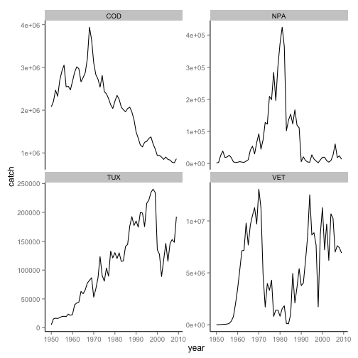

```coffee
library(rfisheries)
library(reshape2)
library(ggplot2)
```


```coffee
species <- species_codes(progress = "none")
tunas <- grep("Tuna", species$english_name)
```


```coffee
who <- c("TUX", "COD", "VET", "NPA")
by_species <- lapply(who, function(x) landings(species = x))
```

```
## Error: Results must be all atomic, or all data frames
```

```coffee
names(by_species) <- who
```


```coffee
dat <- melt(by_species, id = c("catch", "year"))
names(dat) <- c("catch", "year", "a3_code")
```


Tidy data is easy to plot:


```coffee
ggplot(dat, aes(year, catch)) + geom_line() + facet_wrap(~a3_code, scales = "free_y")
```

 


```coffee
library(data.table)
species <- data.table(species)
setkey(species, "a3_code")
code_names <- species[who, scientific_name]
```


```coffee
code_names[[2]] <- factor(code_names[[2]])
```


or as a named string,


```coffee
codes <- code_names$scientific_name
names(codes) <- code_names$a3_code
codes
```

```
##               TUX               COD               VET               NPA 
##       Scombroidei      Gadus morhua Engraulis ringens  Engraulis mordax 
## Levels: Engraulis mordax Engraulis ringens Gadus morhua Scombroidei
```


We set column classes appropriately:


```coffee
dat$year <- as.Date(as.character(dat$year), format = "%Y")
dat$a3_code <- as.factor(dat$a3_code)
```


```coffee
library(reml)
```


We add essential metadata to the table definiting the column headings and their units: 


```coffee
dat <- data.set(dat, col.defs = c(catch = "Global Landings of fish", year = "the year for which data was reported", 
    a3_code = "a 3 digit country code"), unit.defs = list(catch = c("tonnes", 
    precision = 1), year = "YYYY", a2_code = codes))
```


If names are not provided for `col.defs` and `unit.defs` reml will assume these are given in the order of the columns of the data frame. 


```coffee
description <- "Landings data for several species by year, from the OpenFisheries database"
eml_write(dat = dat, title = "Landings Data", description = description, creator = "Karthik Ram <karthik@ropensci.org>", 
    file = "landings.xml")
```

```
## Loading required package: uuid
```

```
## Warning: Setting class(x) to NULL; result will no longer be an S4 object
```

```
## [1] "landings.xml"
```


## Publish to rfigshare


```coffee
eml_publish("landings.xml", description = description, categories = "Ecology", 
    tags = "fisheries", destination = "figshare", visibility = "public")
```

```
## text_content() deprecated. Use parsed_content(x, as = 'parsed')
## Your article has been created! Your id number is 827296
## text_content() deprecated. Use parsed_content(x, as = 'parsed')
## text_content() deprecated. Use parsed_content(x, as = 'parsed')
```

```
## [1] 827296
```


## Adding Location context with GBIF


```coffee
library(rgbif)
omany <- failwith(NULL, occurrencelist_many)
locations <- llply(as.list(code_names$scientific_name), omany, .progress = "none")
names(locations) <- who
species_loc <- lapply(locations, function(x) data.frame(species = x[1], Lat = x[3], 
    Long = x[4]))
loc <- melt(species_loc, id = names(species_loc[[1]]))
names(loc) <- c("scientific_name", "Lat", "Long", "a3_code")
a <- join(dat, loc, by = "a3_code")
```


Richer GBIF record ...


```coffee
omany <- failwith(NULL, occurrencelist)
locations <- llply(as.list(code_names$scientific_name), omany, format = "darwin", 
    .progress = "none")
gbif_dat <- lapply(locations, gbifdata, minimal = FALSE)
```


